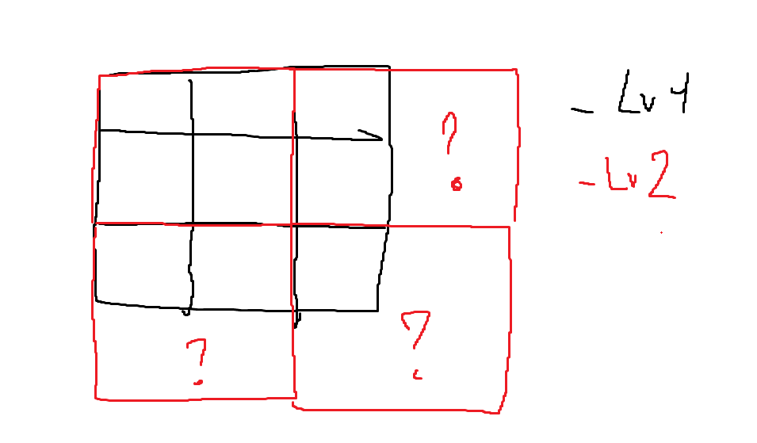
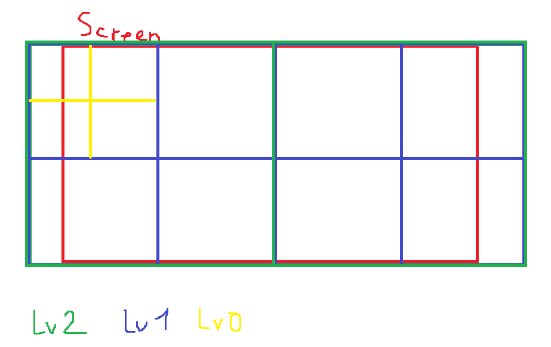
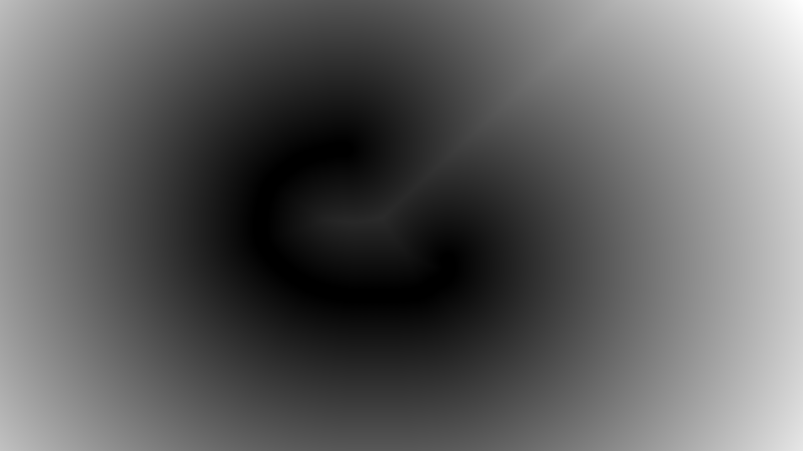
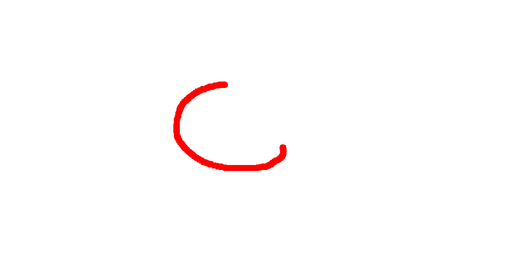
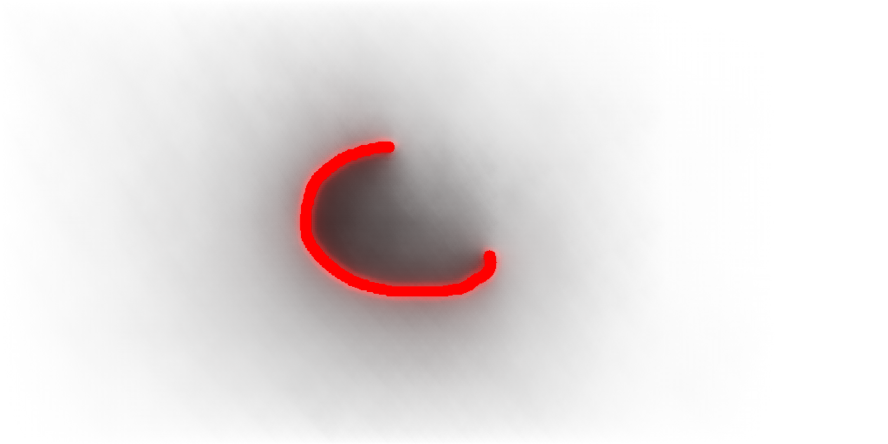

+++
title= 'Radiance Cascade Global Illumination'
date= 2024-10-22T13:52:18-04:00
draft= false
author= "tlegoc"
image = "/images/gi1.png"
description= "Small blog post with demo of my radiance cascade gi project."
+++

## Intro

Recently I stumbled upon a [video from SimonDev](https://www.youtube.com/watch?v=3so7xdZHKxw) talking about a new global illumination algorithm made by Alexander Sannikov from Grinding gear games.

Lighting and especially global illumination is a subject I really liked so I wanted to give this algorithm a shot. And although I first tried in 3D, I ended up doing it in 2D so I could understand the concepts more and use vulkan outside of vkguide.

In this post I'll share one of the problems I encountered and present how the app works. I am however not going to talk about ray calculation and raymarch, or how I decide what rays to send (see [this great post by tmpvar](https://tmpvar.com/poc/radiance-cascades/)).

## Demo

 

## Cascade resolution

One of the first problems I met was how to decide the resolution of the cascade. At first I wanted to do a simple approach in which I ask the developper for the number of pixels on the screen a single probe overlaps.

This caused many problems as the resolution might not be a number suited for the number of cascade requested.

*
Where do I store the next level ?
*

One solution would have been to extend the texture, but that resulted in the bottom and right side of the screen having more probes to interpolate with. Moreover I wasn't satisfied with the way you had to find probe positions on the screen.

In the end, I settled for another solution : Specify the number of cascades you want, the number of vertical probes you want at max level and create a texture resolution that stretches a little on the side. By doing this you can essentially untie the screen resolution from the cascade resolution. The only downside is that the left and right sides are gonna have a bit more probes, but at least it's symmetric. Finding probe positions is just a matter of manipulating UVs.

*
Final layout
*

## Single frame example

Assuming you have a RGBA 32F texture holding the color (RGB) and the distance (A) to the nearest point.

*
Normalized alpha (distance)
*

You then dispatch N compute shader to raycast to N targets, with N being the number of cascades. This can be done in parallel.

*
Raymarch output (level 0)
*

*
Raymarch output (level 1)
*

*
Raymarch output (level 2)
*

Once done, you can merge each cascade on the cascade below (cascade 7 to 6, 6 to 5, etc). This is important that each dispatch waits on the previous compute shader, so the ray accumulation is correct.

In order to merge correctly, you need to find the nearby probes in above level. Then you find the 4 nearest rays, sample and get the mean of the values for each probe. Finally, you do a simple bilinear interpolation step on each of the probe values.

*
Merged rays
*

In the end, you can find the average luminance for each probe (mean of all rays) and composite the result with the processed SDF.

*
Result
*

## Conclusion

You can see that the algorithm isn't hard to understand (thanks to the work of tmpvar, SimonDev and Alexander Sannikov) and is quite fun to implement, while giving great results. My implementation is not optimized though, it can crash if you make the rays too big or use a raymarch step too small and some artifacts are visible at low resolution (which shouldn't happen). But I'm very happy with the result.

The next step would be to create a 3D version (my initial plan in Unity, using screenspace raymarching) of the algorithm or a fake 3D version (see [Alexander's Exile con talk, near 36:55](https://youtu.be/TrHHTQqmAaM?t=2218)), but for another time :)

## References

- tmpvar : https://tmpvar.com/poc/radiance-cascades/
- paper : https://drive.google.com/file/d/1L6v1_7HY2X-LV3Ofb6oyTIxgEaP4LOI6/view
- Exile con conference : https://www.youtube.com/watch?v=TrHHTQqmAaM&t=1613s
- SimonDev video : https://www.youtube.com/watch?v=3so7xdZHKxw
- SimonDev live demo : https://simondevyoutube.github.io/Shaders_RadianceCascades/
- Alexander Sannikov 3D implementation : https://www.youtube.com/watch?v=N6RP3r1M9g4
- Alexander Sannikov 2D implementation : https://www.youtube.com/watch?v=o2kgW2TBpUo